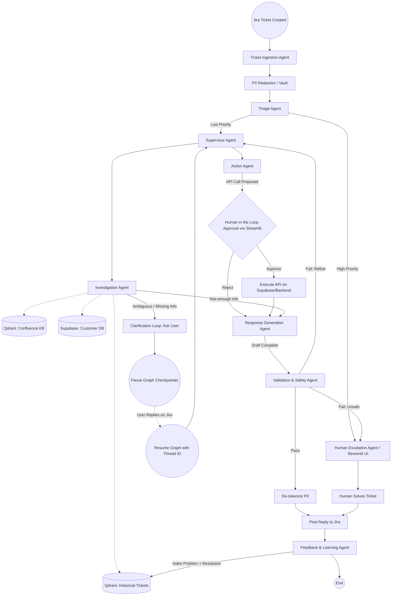

# Multi-Agent Customer Support System Architecture

```mermaid
graph TD
    Start((Jira Ticket Created)) --> Ingestion[Ticket Ingestion Agent]
    Ingestion --> PII[PII Redaction / Vault]
    PII --> Triage[Triage Agent]
    
    Triage -- High Priority --> Escalation[Human Escalation Agent / Streamlit UI]
    Triage -- Low Priority --> Supervisor[Supervisor Agent]
    
    Supervisor --> Investigation[Investigation Agent]
    Supervisor --> Action[Action Agent]
    
    Investigation -.-> Qdrant_Conf[(Qdrant: Confluence KB)]
    Investigation -.-> Qdrant_Hist[(Qdrant: Historical Tickets)]
    Investigation -.-> Supabase[(Supabase: Customer DB)]
    
    Action -- API Call Proposed --> HITL{Human in the Loop Approval via Streamlit}
    HITL -- Approve --> Execute[Execute API on Supabase/Backend]
    HITL -- Reject --> DraftReply
    Execute --> DraftReply
    
    Investigation -- Has enough info --> DraftReply[Response Generation Agent]
    Investigation -- Ambiguous / Missing Info --> Clarify[Clarification Loop: Ask User]
    
    Clarify --> Pause((Pause Graph Checkpointer))
    Pause -. User Replies on Jira .-> Resume((Resume Graph with Thread ID))
    Resume --> Supervisor
    
    DraftReply -- Draft Complete --> Validate[Validation & Safety Agent]
    
    Validate -- Pass --> RestorePII[De-tokenize PII]
    Validate -- Fail: Refine --> Supervisor
    Validate -- Fail: Unsafe --> Escalation
    
    RestorePII --> PostJira[Post Reply to Jira]
    Escalation --> HumanWork[Human Solves Ticket]
    HumanWork --> PostJira
    
    PostJira --> Feedback[Feedback & Learning Agent]
    Feedback -- "Index Problem + Resolution" --> Qdrant_Hist
    Feedback --> Done((End))
```
