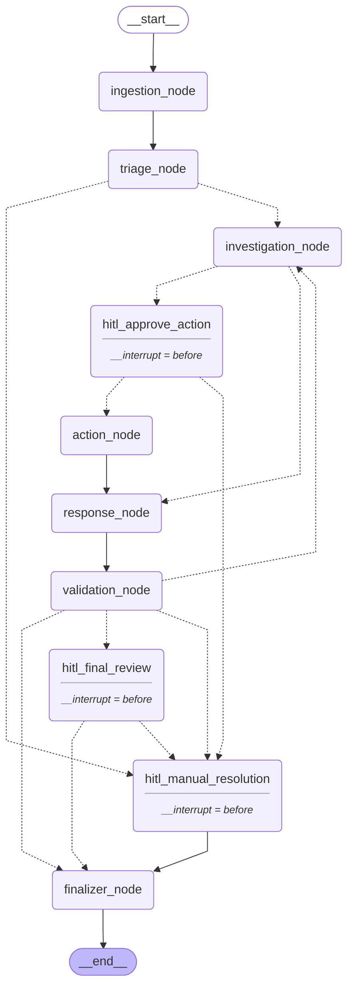

# Aura Bank Multi-Agent System Architecture

```mermaid
---
config:
  flowchart:
    curve: linear
---
graph TD;
	__start__([<p>__start__</p>]):::first
	ingestion_node(ingestion_node)
	triage_node(triage_node)
	investigation_node(investigation_node)
	action_node(action_node)
	response_node(response_node)
	validation_node(validation_node)
	finalizer_node(finalizer_node)
	hitl_manual_resolution(hitl_manual_resolution<hr/><small><em>__interrupt = before</em></small>)
	hitl_approve_action(hitl_approve_action<hr/><small><em>__interrupt = before</em></small>)
	hitl_final_review(hitl_final_review<hr/><small><em>__interrupt = before</em></small>)
	__end__([<p>__end__</p>]):::last
	__start__ --> ingestion_node;
	action_node --> response_node;
	hitl_approve_action -.-> action_node;
	hitl_approve_action -.-> hitl_manual_resolution;
	hitl_final_review -.-> finalizer_node;
	hitl_final_review -.-> hitl_manual_resolution;
	hitl_manual_resolution --> finalizer_node;
	ingestion_node --> triage_node;
	investigation_node -.-> hitl_approve_action;
	investigation_node -.-> response_node;
	response_node --> validation_node;
	triage_node -.-> hitl_manual_resolution;
	triage_node -.-> investigation_node;
	validation_node -.-> finalizer_node;
	validation_node -.-> hitl_final_review;
	validation_node -.-> hitl_manual_resolution;
	validation_node -.-> investigation_node;
	finalizer_node --> __end__;
	classDef default fill:#f2f0ff,line-height:1.2
	classDef first fill-opacity:0
	classDef last fill:#bfb6fc

```
